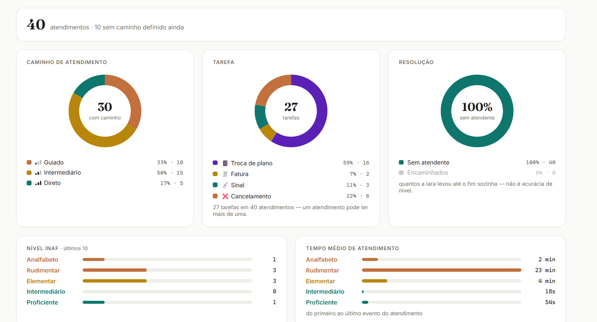
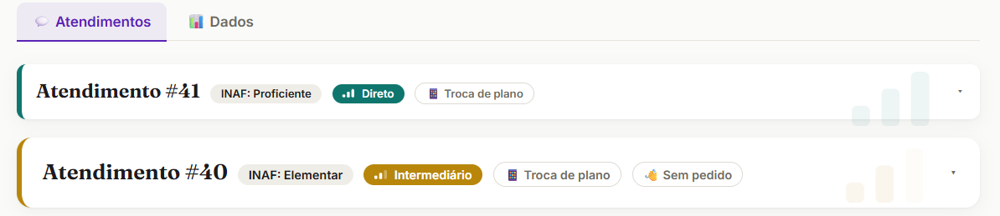
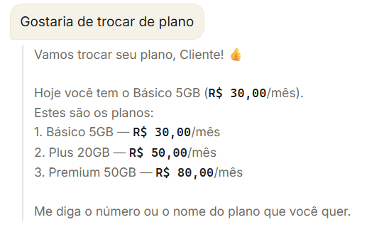

# Iara

**Uma assistente que adapta o atendimento ao nível de letramento digital de cada pessoa — sem nunca perguntar isso diretamente.**

### [projetoiara.tech](https://projetoiara.tech)

Squad Aura · Desafio dos Dados 2026 · Fundação Telefônica Vivo

---

## O problema

Atendimento automático trata todo mundo igual. Quem tem facilidade com tecnologia se irrita com o excesso de passos; quem não tem se perde no meio do caminho e desiste — ou cai no atendimento humano, que custa caro e demora.

A barreira não é falta de acesso à internet. É letramento digital: a capacidade de entender e agir sobre o que a tela está pedindo.

## A ideia

A cada mensagem, a Iara estima o nível de letramento digital de quem está do outro lado — pela escala INAF, de 5 níveis — e escolhe o caminho de atendimento na hora. Funciona com texto ou com áudio transcrito.

| Nível INAF | Caminho | Comportamento |
|---|---|---|
| Analfabeto / Rudimentar | **Guiado** | Passo a passo, confirma tudo, oferece atendente humano após duas respostas confusas seguidas |
| Elementar | **Intermediário** | Meio-termo entre guiado e direto |
| Intermediário / Proficiente | **Direto** | Resolve em uma mensagem |

> **Nenhum rótulo fica gravado na pessoa.** O nível é recalculado a cada interação, nunca fixado num perfil. Quem estava confuso ontem não carrega esse rótulo hoje.

## O que ele faz na prática

Dentro de uma tarefa, desvio de conversa não vira "confusão" automaticamente:

**"o mais barato"** é escolha válida, sem precisar do nome exato do plano.

**"quanto custa o plus?"** é respondido com o dado real, sem contar como desvio.

**Mudar de ideia numa confirmação** — *"quer cancelar a linha?"* → *"na verdade meu sinal tá ruim"* — troca de tarefa, já que nada foi executado ainda.

**Reclamar do valor numa confirmação** — *"25 reais muito caro"* — é reconhecido como reclamação, não como um SIM ou um NÃO. O bot não decide nada sozinho.

## O painel

Enquanto a conversa acontece, um painel web mostra o nível estimado, a confiança do classificador e o caminho escolhido. É o que torna a decisão auditável em vez de mágica.

## Escopo

Quatro tarefas fixas, com dados 100% fictícios: trocar de plano, consultar fatura, reclamação de sinal e cancelar a linha. Fora dessas quatro, o bot admite o limite em vez de adivinhar.

A identificação é simulada — nome e telefone contra uma lista de clientes fictícios, mais um check de quatro dígitos. Nada aqui toca sistema real de ninguém.

## Stack

Python · Telegram Bot API · OpenAI `gpt-5.4-nano` para classificação de nível e intenção · `gpt-4o-mini-transcribe` para áudio · SQLite · painel web com polling.

## Rodar

Instale as dependências com `pip install -r requirements.txt`, copie `.env.example` para `.env` e preencha `TELEGRAM_BOT_TOKEN` e `OPENAI_API_KEY`. Depois, `python bot.py` sobe o bot e `python painel.py` sobe o painel.

## Testes

A suíte cobre o que mais importa num classificador que decide como tratar gente: `teste_classificador.py` (nível INAF → caminho), `teste_intencao.py` (intenção → tarefa), `teste_interprete.py` (desvio no meio da etapa) e `teste_vies.py` — esse último verifica que **a forma de falar não move o nível**, que é o erro mais perigoso que um sistema desses pode cometer.

Os testes de fluxo (`teste_troca_tarefa.py`, `teste_reclamacao_cancelamento.py`, `teste_escolha_plano.py`, `teste_despedida.py`) rodam sem consumir API.

## Limites

Os dados são fictícios e as tarefas são quatro. O que o projeto prova é o mecanismo: dá para medir letramento digital durante o atendimento e adaptar o caminho, sem etiquetar ninguém.

---

Projeto do **Squad Aura** no Desafio dos Dados 2026.
Este repositório reúne o código do protótipo, mantido por **[Murilo Vieira](https://github.com/MuriloDPV)** — **FOX**, automação, IA e software para empresas.

*Tecnologia para fazer o bem*

